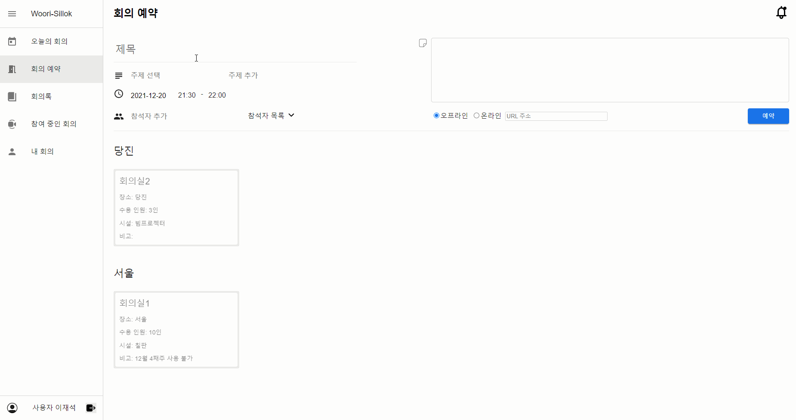

<p align="center">
  
  <h1 align="center">Woori Silok</h1>
</p>

## 회의실 예약과 회의록 작성을 한번에!

회의실 예약과 회의록 작성을 별도의 어플에서 하느라 귀찮으셨을 분들을 위한 서비스입니다.

우리실록을 통해 두 가지 기능을 한 곳에서 수행해보세요.

## 주요 기능

- 오늘 예정된 회의 한 눈에 보기
- 간단한 회의 예약
- MarkDown 기능이 가능한 글쓰기
- 회의록 공유 및 공유 대상에게 메일로 알리기

## 서비스 화면

### 오늘의 회의


### 회의실 예약



### 회의록


### 참여 중인 회의


### 내 회의


## 설치 및 실행 방법

```
$ git clone https://github.com/woori-silok/project.git
```

- 프론트엔드

```
$ npm install
$ npm start
```

- 백엔드

  - Windows

```
$ ./gradlew bootJar
$ cd build/libs
$ java -jar springboot-basic-0.0.1-SNAPSHOT.jar
```

## 서비스 아키텍처


- 프론트엔드
  - Github에서 push한 소스코드는 GitHub Actions를 통해 Amazon S3에 업로드 됩니다.
  - Amazon CloudFront를 통해 웹서버의 부담을 경감시키고, 전세계의 사용자를 대상으로 고속으로 컨텐츠를 제공합니다
- 백엔드
  - Github에 배포한 소스코드는 GitHub Actions를 통해 AWS ElasticBeanstalk에 디플로이 됩니다.
  - 회의록 첨부파일은 Amazon S3에 업로드됩니다.
  - Load Banlancer를 사용함으로써 무중단 배포를 가능하게 합니다.

## ERD


## 개발 환경

### 프론트엔드
- Typescript
- React
- MUI
- Emotion
- Amazon S3
- Amazon CloudFront

### 백엔드
- Java
- Spring Boot
- Spring Data JPA
- Spring Security
- Amazon RDS MySQL
- AWS BeanStalk
- Amazon S3

### CI/CD
- Github Actions

### 커뮤니케이션
- Slack
- Github Project
- SwaggerHub
- Google Meet

## 팀원 역할

- 이병현
  - Figma를 활용하여 와이어프레임 설계
  - 프론트엔드 프로젝트 세팅
  - 참여 중인 회의 페이지 에디터 구현
  - 내 회의 페이지의 달력 기능 구현
  - AWS CDK를 이용한 Amazon S3, Amazon CloudFront 리소스 정의 (iac)
  - GitHub Actions를 이용하여 CI/CD 설정 (Amazon S3 업로드, Amazon CloudFront invalidation)
  - 도메인 설정 (Amazon Route53) [woorisilok.ga](https://woorisilok.ga/)
  - 백엔드에서 사용중인 ALB에 ACM을 붙여 백엔드 엔드포인트에 https 추가
- 이재석
  - Figma를 활용하여 와이어프레임 설계
  - 프론트엔드 로그인 검증 구현
  - 로그인 페이지 구현
  - 오늘의 회의 페이지 구현
  - tui-date-picker를 사용하여 회의 예약 페이지 구현
  - tui-editor를 사용하여 회의록 페이지 구현
  - 참여 중인 회의 페이지, 파일 업로드 구현
- 인영은 (Backend)
  - JWT 인증 사용한 로그인	
  - 내가 참여한 회의 / 참여 예정 회의 확인
  - 회의실 조회
  - 회의실 상세 정보 조회
  - 회의실 예약 현황 조회
  - 회의실 예약
  - 회의록 리스트 - 주제별로 필터링
  - 회의록 작성
  - 회의록 공유
  - 파일 업로드 / 다운로드
- 황민주
